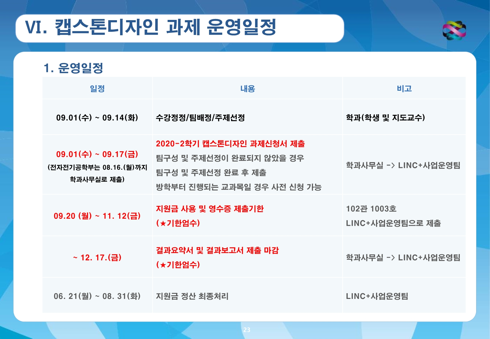

## Tello_drone Project

> 종합설계 제안서 제목

1. 설계 목표
1. 제안 배경(필요성, 기존 제품이 있다면 그 성능 평가, 수요조사, 문헌조사 등)
1. 추진 계획(일정표)

텔로의 경우 scratch만 사용가능, 텔로 에듀 python으로 프로젝트 진행

텔로 공식 파이썬 패키지 설치는 [여기](https://edimoon777.github.io/junghomoon/Tellopy/)를 클릭.
텔로 에듀 구매 링크는 [여기](https://store.dji.com/kr/product/tello-edu?vid=47091)

### 체크리스트

-드론비 지원 가능여부

캡스톤 일정

### 제출서류

※ 모든 제출서류는 한글파일로 작성(수기작성 금지, 서명은 수기로 진행)
